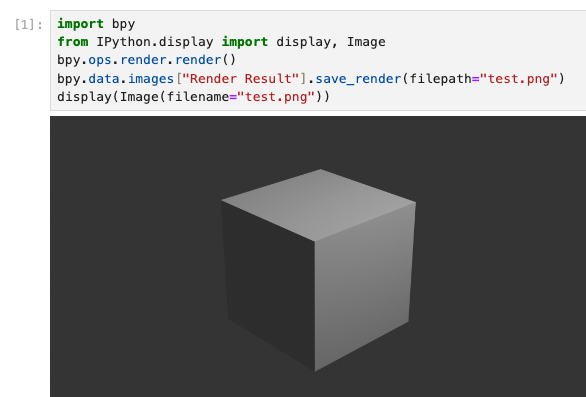

# Getting Started

## How can I use Blender with Python?

Blender has a built-in Python editor, but sometimes it’s useful to work in environments like Jupyter notebooks or VS Code notebooks.

There are two ways to use Blender in a notebook:  

1.	Headless Mode: In this mode, you install the Blender Python module bpy from PyPi. The Blender GUI doesn’t open, so you can run it even without a Blender installation.  
2.	GUI Mode: This mode uses your installed Blender version, so you can work in the Blender GUI while sending commands from the notebook.

# WORK IN PROGRESS.

Probably in March 2025 there will be a new guide on how to use Blender w. Jupyter.
Till then, here's the repo for further installation instructions: https://github.com/Octoframes/bpy_jupyter

<!-- ## Python Package manger UV

For the installation, we use the package manager [uv](https://docs.astral.sh/uv/getting-started/installation/).

The advantage of `uv` is that it automatically manages and caches your environment. You can run the same command multiple times without needing virtual environments or handling Python installations manually.


Installation **macOS**:
`curl -LsSf https://astral.sh/uv/install.sh | sh`


Installation **Windows**:
`powershell -ExecutionPolicy ByPass -c "irm https://astral.sh/uv/install.ps1 | iex"`


## Using Headless Mode


To start the notebook, run:
`uvx --python 3.11 --with bpy==4.2.0 jupyter lab`




??? Code

    ```py
    import bpy
    from IPython.display import display, Image
    bpy.ops.render.render()
    bpy.data.images["Render Result"].save_render(filepath="img.png")
    display(Image(filename="img.png"))
    ```

**Note:** The headless mode will *only* run with Python 3.11 (as of Blender 4.2).

## Using GUI Mode

To set up Blender in GUI mode, we first register the Blender kernel with your notebook environment.


On **macOS**, run:  
`uvx blender_notebook install --blender-exec="/Applications/Blender.app/Contents/MacOS/Blender"`

`uvx --python 3.11 jupyter lab`

(under the hood, this is using [blender_notebook](https://github.com/cheng-chi/blender_notebook))

On **Windows**, run:  
`uvx blender_notebook install --blender-exec="C:\Program Files\Blender Foundation\Blender 4.2\blender.exe"`

`uvx --python 3.11 jupyter lab`
(Windows installation is not yet tested)

Once set up, you can select the Blender kernel in Jupyter Lab.

Select the Blender kernel in **JupyterLab** like this:
<video controls src="../jupyterlab_setup.mp4" title="Title"></video>


**Note**: GUI mode also works with other notebook environments, such as VS Code notebooks and Satyrn notebooks.


Select the Blender kernel in **VS Code** like this:
<video controls src="../vscode_setup.mp4" title="Title"></video> -->


